 
 

<em>I find human problems, design the systems, and ship the product.</em>

 
 

&nbsp;

&nbsp;

&nbsp;

## 🔒 Private Founder Builds

Both repositories are private. What follows is architecture, role, and engineering decisions — never proprietary code, product flows, or business strategy.

### 🧠 Nureli — iOS Emotional Wellness Platform
**by Soul Nestle · Building** — helping adults heal from childhood emotional neglect through science-backed, trauma-informed support.

> **The problem** — Wellness apps are mostly shallow content wrappers, and a clinical-adjacent space has a constraint most ignore: a user can be in genuine crisis mid-session. The product must be personal and AI-assisted, yet **safe, private, and responsible by construction** — not by disclaimer.

**My role** — sole iOS founder-engineer: app architecture, the server-side AI & safety layer, data & privacy model, design system, and monetization.

| Layer | What I built |
|---|---|
| 📲 **App** | SwiftUI · MVVM · `@Observable` (iOS 17) · ~27K LOC across **13 feature modules** · a layered Core |
| 🛡️ **AI & safety** | OpenAI reachable **only** via Supabase Edge Functions — key never on device · **crisis detection runs first in every call** → routes to the 988 Lifeline, bypassing all other logic · per-user daily rate limit that degrades into a gentle in-voice message |
| 🔐 **Data & privacy** | PostgreSQL with **RLS on every user table** · offline-first SwiftData store synced to remote · private voice bucket · **zero health/emotional content in analytics** |
| 🎯 **Personalization** | Pattern-detection + feature-threshold engines that progressively reveal the experience from emotional signals |
| 🛰️ **Server-driven** | Remote-config + feature-policy engines change content, flags & unlocks **without an App Store release** |
| 💳 **Monetization** | RevenueCat — every feature available Day 1, a single `isPremium` gate |

**Decisions worth calling out**
- **Safety supersedes everything** — crisis detection runs *before* rate-limiting or product logic; a user in crisis is never gated away from the 988 response.
- **The AI key never reaches the client** — all model calls go server-side, with cost/abuse limits and in-voice failure modes.
- **Privacy by architecture, not policy** — RLS everywhere, offline-first source of truth, analytics structurally blind to emotional data.

`Swift 6` `SwiftUI` `Supabase` `PostgreSQL + RLS` `Edge Functions` `OpenAI` `RevenueCat` `PostHog`

🌱 Pre-incubated at VIT · built with the VIT counselling team & clinical psychologists · began as a workbook that reached **1,000+ people**, now shaping the product.

 

### 🪷 Cultural-Technology Platform
**Founder / Product Engineer · Live, in stealth** — *technology used to preserve meaningful human experiences and make them accessible.*

> **The problem** — Millions of families want authentic, correctly-performed rituals but are blocked by distance, time, and finding trusted, verified practitioners. The experience is high-trust, multi-step, and ends with a **physical** offering in your hands — all hard to make feel authentic online.

**My role** — sole founder-engineer: architecture and build across frontend, backend, payments, AI, data, fulfillment, and growth.

| Layer | What I built |
|---|---|
| 🌐 **Web** | Next.js 15 (App Router) · React 19 · TypeScript · Tailwind · Framer Motion |
| 🗣️ **i18n** | `next-intl`, fully bilingual (English / Hindi), locale-routed via edge middleware |
| 🗄️ **Data** | Supabase / PostgreSQL · 20+ versioned migrations · normalized devotees, bookings, catalog, subscriptions & shipments |
| 💳 **Payments** | **Provider-neutral** layer over multiple gateways (UPI · cards · subscriptions) · signature verification · an **idempotent webhook ledger** that survives retries without double-charging |
| 🤖 **AI** | Provider-abstracted LLM layer generating a **personalized ritual intention (Sankalp)** from structured inputs — with **deterministic, fallback-safe degradation** so a booking never breaks when the model does |
| 📦 **Fulfillment** | Logistics integration for physical delivery — full shipment lifecycle & tracking |
| 📈 **Growth** | Meta Pixel + **server-side Conversion API** · abandoned-lead recovery · workflow automation (n8n) |

**Decisions worth calling out**
- **Provider-neutral payments** — gateways behind one interface; an idempotent processed-event ledger makes webhook retries safe.
- **AI that fails gracefully** — every generated output has a deterministic fallback; the revenue path never depends on a model call.
- **Trust-first by design** — verified practitioners, live documentation, transparent payment & refund flows.

`Next.js` `React` `TypeScript` `Supabase` `PostgreSQL` `Razorpay` `OpenAI` `Vercel`

🪔 Multilingual, mobile-first, built for non-technical users on patchy networks.

## 👋 About

I'm a CS undergrad (2nd year) and **founder-engineer** building human-centered technology where **psychology, AI, and mobile engineering** meet.

I don't just write code for projects — I find a real human problem, design the system around it, and ship a product people actually use. My work lives at the intersection of **emotional wellness, cultural technology, and applied AI**, backed by clean architecture and a bias toward shipping.

<table>
<tr>
<td>🛠️</td><td><b>Founder-engineer</b> — own the problem end to end: research → architecture → ship → iterate</td>
</tr>
<tr>
<td>📱</td><td><b>iOS</b> — Swift / SwiftUI, MVVM, a ~27K-LOC production app with Supabase + on-device privacy</td>
</tr>
<tr>
<td>🤖</td><td><b>Applied AI</b> — LLM pipelines with deterministic, auditable safety layers (not black-box wrappers)</td>
</tr>
<tr>
<td>🧠</td><td><b>Human-centered</b> — trauma-informed, research-driven product design with clinical input</td>
</tr>
<tr>
<td>⚙️</td><td><b>Systems thinking</b> — graph algorithms, double-entry ledgers, real-time pipelines, RLS isolation</td>
</tr>
</table>

## 🧭 What I'm Building

<table>
<tr>
<td width="33%" align="center" valign="top">

### 🧠
**Emotional Wellness**
  
**Nureli** — iOS app
 
by Soul Nestle

</td>
<td width="33%" align="center" valign="top">

### 🪷
**Cultural Technology**
  
Private platform
 
in stealth

</td>
<td width="33%" align="center" valign="top">

### ⚙️
**Engineering**
  
Open systems & tools
 
public · below

</td>
</tr>
</table>

## 🚀 Featured Engineering

Public, open work — four recent builds that show range: safety-critical AI, large-scale simulation, financial systems, and AI-for-data.

<table>
<tr>
<td width="50%" valign="top">

#### 🚑 [Nirnay-112](https://github.com/shaswatnaman/Nirnay-112)
**Real-time emergency-call triage** · Hindi / Hinglish

Hybrid **LLM perception + deterministic, auditable decision logic** for noisy 112 calls — streaming transcripts, confidence-decay memory, append-only audit log.

`Python` `FastAPI` `WebSockets` `OpenAI`

</td>
<td width="50%" valign="top">

#### 🦠 [outbreak-explorer](https://github.com/shaswatnaman/outbreak-explorer)
**Epidemic simulation engine** · at scale

SIR simulator over directed graphs — **50K–100K nodes at &lt;150ms/step** with live map visualization and a benchmark suite that proves it.

`TypeScript` `React` `Deno` `TypedArrays`

</td>
</tr>
<tr>
<td width="50%" valign="top">

#### 💸 [fintech-ledger](https://github.com/shaswatnaman/fintech-ledger)
**Double-entry bookkeeping** · fintech-grade

Balanced debit/credit integrity enforced **at the database level** — multi-tenant RLS, stateless JWT auth, load-tested under concurrency.

`TypeScript` `PostgreSQL` `Supabase` `RLS`

</td>
<td width="50%" valign="top">

#### 📊 [DataStory](https://github.com/shaswatnaman/DataStory)
**Natural-language data analysis** · AI

Ask in plain English → AI generates and **safely executes** Python for charts & insights, with conversation memory across queries.

`Python` `Flask` `OpenAI` `matplotlib`

</td>
</tr>
</table>

## 🧩 Tech I Reach For

**Languages**

**Mobile & Web**

**Backend & Data**

**AI & Infra**

 

`Problem → Research → Architecture → Ship → Measure → Iterate`

Privacy by default · clean architecture · measurable performance · ship, then iterate.

## 💼 Why I'd Be Valuable on Your Team

| | |
|---|---|
| 🎯 **Ownership** | I take ambiguous problems from zero to shipped product without hand-holding. |
| 🚢 **Shipping** | A 27K-LOC production iOS app and four substantive systems projects — not tutorials. |
| ⚡ **Learning speed** | A 2nd-year student already working across iOS, backend, AI, and product. |
| ❤️ **User empathy** | I design from real human problems and real user research. |
| 🧠 **Systems judgment** | I know *when* determinism beats an LLM, when RLS beats app-layer auth, and how to prove a performance claim. |

### Let's build something that matters.

Founder-engineer · building emotionally intelligent and culturally meaningful products through software.

